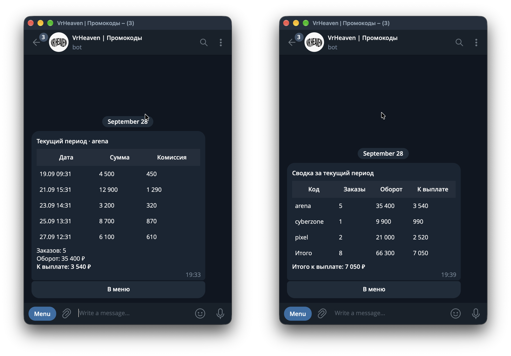

<p align="center">
  Telegram-бот партнёрской программы VR Heaven: учёт заказов по промокодам партнёров, начисление комиссий и выплаты. Панель администратора и личный кабинет партнёра работают в одном боте.
</p>

<p align="center">
  
  
  
  
  
</p>

<p align="center">
  
</p>

## Применение

Бот используется в партнёрской программе VR Heaven. Партнёры - офлайн-заведения, например ПК-клубы, - раздают клиентам промокоды. Администратор вносит заказ с промокодом по факту оплаты, бот начисляет партнёру комиссию и отправляет уведомление, партнёр видит свои начисления в личном кабинете. Плановые дни выплат - 1-е и 15-е число месяца.

## Возможности

Администратор:
- оформление и мягкая отмена заказов с пересчётом начислений;
- подключение партнёров: промокод, заведение, индивидуальная ставка комиссии, одноразовый показ сгенерированного пароля;
- приостановка, смена пароля с отключением всех устройств, удаление с сохранением истории;
- сводка по всем партнёрам и проведение выплаты, закрывающей учётный период;
- экспорт партнёров, заказов и выплат в CSV.

Партнёр:
- вход по промокоду и паролю с ограничением числа попыток;
- текущий период и история выплат в виде нативных таблиц Telegram;
- уведомления о заказах, отменах и выплатах на все подключённые устройства, предупреждение о входе с нового устройства.

По расписанию:
- 1-го и 15-го числа в 10:00 - сводка администраторам и отчёты о закрытии периода партнёрам;
- ежедневно в 03:00 - резервная копия базы (`VACUUM INTO`) администраторам в чат.

## Архитектура

- **Одно окно.** В каждом чате бот держит ровно одно сообщение: экраны рендерятся его редактированием, ввод пользователя, включая пароли, удаляется. Идентификатор окна хранится в базе и переживает перезапуск.
- **Нативные таблицы.** Отчёты отправляются через Bot API Rich Messages (`sendRichMessage`, параметр `rich_message` в `editMessageText`) из HTML-разметки `<table>`.
- **Две роли в одном боте.** Роутер администратора фильтрует по списку Telegram ID из `.env`, остальные пользователи попадают в кабинет партнёра.
- **История без потерь.** Удаление партнёров и отмена заказов мягкие; промокод закреплён только за действующим партнёром и после удаления может быть выдан заново. Схема базы обновляется пошаговыми миграциями.
- **Пароли** хранятся как PBKDF2-HMAC-SHA256 с индивидуальной солью, сравнение выполняется за постоянное время.

Полное техническое описание: [SPEC.md](SPEC.md).

## Установка

Требования: Python 3.12, [uv](https://docs.astral.sh/uv/), токен бота от [@BotFather](https://t.me/BotFather).

```bash
git clone https://github.com/TihonSotnikov/VrHeaven-PromoBot.git
cd VrHeaven-PromoBot
uv sync
cp .env.example .env
```

## Настройка

Параметры задаются в `.env`:

| Переменная | Назначение | По умолчанию |
|---|---|---|
| `BOT_TOKEN` | токен бота | - |
| `ADMIN_IDS` | Telegram ID администраторов через запятую | - |
| `TIMEZONE` | часовой пояс расписаний и дат | `Europe/Moscow` |
| `DB_PATH` | путь к файлу SQLite | `partnerbot.db` |

## Использование

```bash
uv run python main.py
```

Бот работает в режиме long polling, база создаётся при первом запуске. Администратор открывает панель командой `/start`, партнёр входит в кабинет по промокоду и паролю, выданным администратором.

## Тестирование

```bash
uv run pytest
```

60 тестов без обращения к сети: хендлеры вызываются напрямую на фейковом боте и реальной SQLite-базе. Покрыты сценарии FSM, инварианты окна, жизненный цикл промокодов, отмена заказов, несколько устройств у партнёра и миграции схемы.
