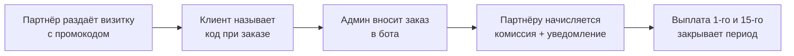

# VR Heaven · PromoBot


Telegram-бот для учёта партнёрской программы моего личного бренда **VR Heaven**.
Партнёры (ПК-клубы и похожие заведения) раздают визитки с промокодами, а бот
считает заказы, начисляет комиссию и ведёт выплаты. Всё это работает в одном
боте: там есть панель администратора и личный кабинет партнёра.

## Как это работает



- Комиссия по умолчанию составляет 10%. Ставку можно задать каждому партнёру отдельно, а в заказе она фиксируется на момент оформления.
- **Текущий период** партнёра включает все его невыплаченные заказы. Выплата закрывает период.

## Возможности

- **Админ:** заказы (добавление и мягкая отмена), партнёры (создание, приостановка, смена пароля и ставки, удаление), сводка, выплаты, экспорт в CSV.
- **Партнёр:** вход по промокоду и паролю, текущий период, история выплат, push-уведомления. К одному кабинету можно подключить несколько аккаунтов.
- **Автоматика:** 1-го и 15-го числа бот рассылает сводки и отчёты, а каждую ночь присылает админам резервную копию базы.
- **Интерфейс «одно окно»:** в чате всегда одно сообщение бота, экраны обновляются на месте, а ввод пользователя (включая пароли) бот сразу удаляет.
- **Нативные таблицы Telegram** (Rich Messages) для отчётов.

## Технические решения

- **Стек:** Python 3.12 · [aiogram 3](https://docs.aiogram.dev) (FSM, роутеры) · SQLite через `aiosqlite` · APScheduler · [uv](https://docs.astral.sh/uv/).
- **Пароли** хранятся только в виде хэшей PBKDF2-SHA256 с солью; сравнение идёт за постоянное время, на вход даётся 5 попыток.
- **Миграции схемы** выполняются автоматически при старте, поэтому базы старых версий обновляются сами.
- **Бэкап** делается консистентной копией через `VACUUM INTO`.
- **Даты** хранятся в UTC, а показываются в часовом поясе из `.env`.
- **60 тестов** на pytest, в том числе сквозные FSM-сценарии на фейковом боте.

Подробная техническая документация (модель данных, сценарии, протокол callback-ов) лежит в [SPEC.md](SPEC.md).

## Быстрый старт

```bash
git clone https://github.com/TihonSotnikov/VrHeaven-PromoBot.git
cd VrHeaven-PromoBot
uv sync                 # uv сам поставит Python 3.12 и зависимости
cp .env.example .env    # заполните переменные
uv run main.py
```

| Переменная  | Описание                                                  | По умолчанию    |
|-------------|-----------------------------------------------------------|-----------------|
| `BOT_TOKEN` | Токен бота от [@BotFather](https://t.me/BotFather)        | обязательно     |
| `ADMIN_IDS` | Telegram ID админов через запятую ([@userinfobot](https://t.me/userinfobot)) | обязательно |
| `TIMEZONE`  | Часовой пояс для расписаний и дат                         | `Europe/Moscow` |
| `DB_PATH`   | Путь к файлу базы                                         | `partnerbot.db` |

Тесты:

```bash
uv run pytest
```

<details>
<summary><b>Руководство администратора</b></summary>

Доступ есть только у Telegram-аккаунтов из `ADMIN_IDS`. Меню открывается командой `/start`.

**Заказы**
- *Добавить заказ*: выбрать промокод (кнопками, только действующие партнёры), ввести сумму и подтвердить. Сумму можно писать как `1500`, `1 500`, `1500,50` или `1500.50`. Партнёр получает уведомление.
- *Отменить заказ*: выбрать один из последних 10 заказов и подтвердить. Отменённый заказ выпадает из всех расчётов, но остаётся в истории и экспорте. Если заказ уже выплачен, проведённая выплата не меняется.

**Партнёры**
- *Добавить*: промокод (латиница, цифры, `-`, `_`, от 2 до 32 символов), название заведения, контакт. Пароль генерируется автоматически и показывается **один раз**.
- *Карточка партнёра*:
  - *Приостановить / Активировать*: приостановленный партнёр недоступен для новых заказов, а его промокод освобождается.
  - *Новый пароль*: все подключённые устройства отключаются. Это штатный способ отозвать доступ.
  - *Изменить процент*: от 0 (не включая) до 100. Новая ставка действует только на новые заказы.
  - *Удалить*: доступ закрывается, промокод освобождается, а история остаётся в экспорте.

**Сводка и выплаты**
- *Сводка* показывает таблицу текущего периода по всем партнёрам.
- *Выплата*: все невыплаченные заказы партнёра помечаются выплаченными, партнёр получает уведомление.

**Экспорт.** Выгружаются `partners.csv`, `orders.csv` и `payouts.csv` (разделитель `;`, UTF-8 с BOM). Файлы открываются в Excel без настройки.

**Автоматика**
- 1-го и 15-го в 10:00 админы получают сводку, а партнёры с ненулевой суммой получают отчёт.
- Каждый день в 03:00 админам приходит резервная копия базы. Чтобы восстановиться, достаточно положить этот файл на место рабочей базы.

</details>

<details>
<summary><b>Руководство партнёра</b></summary>

- **Вход:** `/start` → «Войти» → промокод (это логин) → пароль. После входа чат привязывается к кабинету. После 5 неверных паролей вход нужно начать заново.
- **Несколько устройств:** можно подключить несколько аккаунтов с одним промокодом и паролем. При входе с нового устройства остальные получают предупреждение.
- **Текущий период:** невыплаченные заказы (последние 25), оборот и сумма к выплате.
- **История выплат:** последние 30 выплат.
- **Уведомления:** новый заказ, отмена заказа, выплата, закрытие периода.

</details>

<details>
<summary><b>Деплой через systemd</b></summary>

`/etc/systemd/system/promobot.service`:

```ini
[Unit]
Description=VR Heaven PromoBot
After=network-online.target
Wants=network-online.target

[Service]
Type=simple
User=promobot
WorkingDirectory=/opt/promobot
ExecStart=/home/promobot/.local/bin/uv run main.py
Restart=always
RestartSec=5

[Install]
WantedBy=multi-user.target
```

```bash
sudo systemctl daemon-reload
sudo systemctl enable --now promobot
journalctl -u promobot -f
```

</details>

## Структура

```
main.py          точка входа, long polling
config.py        загрузка .env
db.py            схема SQLite, миграции, запросы
window.py        интерфейс «одно окно» и нативные таблицы
keyboards.py     inline-клавиатуры
reports.py       табличные отчёты
scheduler.py     дни выплат и бэкапы
utils.py         экранирование, деньги, даты, пароли
handlers/        сценарии админа и партнёра (FSM)
tests/           pytest
```

---

Личный проект для бренда VR Heaven.
